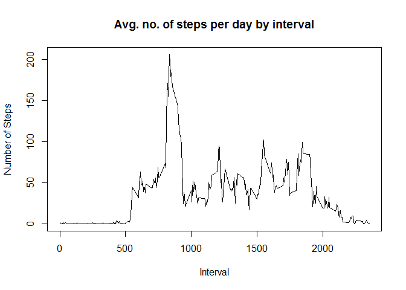

# Reproducible Research: Peer Assessment 1
Abhilash Kulkarni  
##Description of the assignment
This is the first assignment in the Reproducible Research course of John Hopkins
University on Coursera. 

## Loading and preprocessing the data
Koading data into data frame from csv file

```r
dataFile <- "activity.csv"

mydata <- read.table(dataFile,header = TRUE, sep = ",")
```

## What is mean total number of steps taken per day?
Sum steps by day, create Histogram, and calculate mean and median.

```r
steps_by_day <- aggregate(steps ~ date, mydata, sum)

hist(steps_by_day$steps, main = paste("Total Steps Each Day"), col="blue", xlab="Number of Steps")
```

\

```r
steps_mean <- mean(steps_by_day$steps)

steps_median <- median(steps_by_day$steps)
```

The `mean` is `steps_mean` and the `median` is `steps_median`.


## What is the average daily activity pattern?

* Calculate average steps for each interval for all days. 
* Plot the Average Number Steps per Day by Interval. 
* Find interval with most average steps. 

```r
steps_by_interval <- aggregate(steps ~ interval, mydata, mean)

plot(steps_by_interval$interval,steps_by_interval$steps, type="l", xlab="Interval", ylab="Number of Steps",main="Avg. no. of steps per day by interval")
```

\

```r
max_interval <- steps_by_interval[which.max(steps_by_interval$steps),1]
```

The 5-minute interval, on average across all the days in the data set, containing the maximum number of steps is 835.

## Imputing missing values
This part is about inputting missing data with mean values of steps over all the
days for that particular interval

```r
incomplete <- sum(!complete.cases(mydata))
filled_data <- transform(mydata, steps = ifelse(is.na(mydata$steps), steps_by_interval$steps[match(mydata$interval, steps_by_interval$interval)], mydata$steps))
```

To nake the data consistent, the NA values for the first day are filled with 0 so that the data follows the overall rising trend


```r
filled_data[as.character(filled_data$date) == "2012-10-01", 1] <- 0
```

Recount total steps by day and create Histogram. 

```r
steps_by_day_filled <- aggregate(steps ~ date, filled_data, sum)
hist(steps_by_day_filled$steps, main = paste("Total Steps Each Day"), col="blue", xlab="Number of Steps")

#Create Histogram to show difference. 
hist(steps_by_day$steps, main = paste("Total Steps Each Day"), col="red", xlab="Number of Steps", add=T)
legend("topright", c("Filled", "Non-filled"), col=c("blue", "red"), lwd=10)
```

\

Calculate new mean and median for imputed data. 

```r
mean_filled <- mean(steps_by_day_filled$steps)
median_filled <- median(steps_by_day_filled$steps)
```

Calculate difference between imputed and non-imputed data.

```r
mean_diff <- mean_filled - steps_mean
med_diff <- median_filled - steps_median
```

Calculate total difference.

```r
total_diff <- sum(steps_by_day_filled$steps) - sum(steps_by_day$steps)
```
* The filled data mean is 1.0589694\times 10^{4}
* The filled data median is 1.0766189\times 10^{4}
* The difference between the non-filled mean and filled mean is -176.4948964
* The difference between the non-filled mean and filled mean is 1.1886792
* The difference between total number of steps between filled and non-filled data is 7.5363321\times 10^{4}. Thus, there were 7.5363321\times 10^{4} more steps in the filled data.

## Are there differences in activity patterns between weekdays and weekends?
Created a plot to compare and contrast number of steps between the week and weekend. There is a higher peak earlier on weekdays, and more overall activity on weekends.  

```r
weekdays <- c("Monday", "Tuesday", "Wednesday", "Thursday", 
              "Friday")
filled_data$dow = as.factor(ifelse(is.element(weekdays(as.Date(filled_data$date)),weekdays), "Weekday", "Weekend"))

steps_by_interval_filled <- aggregate(steps ~ interval + dow, filled_data, mean)

library(lattice)

xyplot(steps_by_interval_filled$steps ~ steps_by_interval_filled$interval|steps_by_interval_filled$dow, main="Average Steps per Day by Interval",xlab="Interval", ylab="Steps",layout=c(1,2), type="l")
```

\

